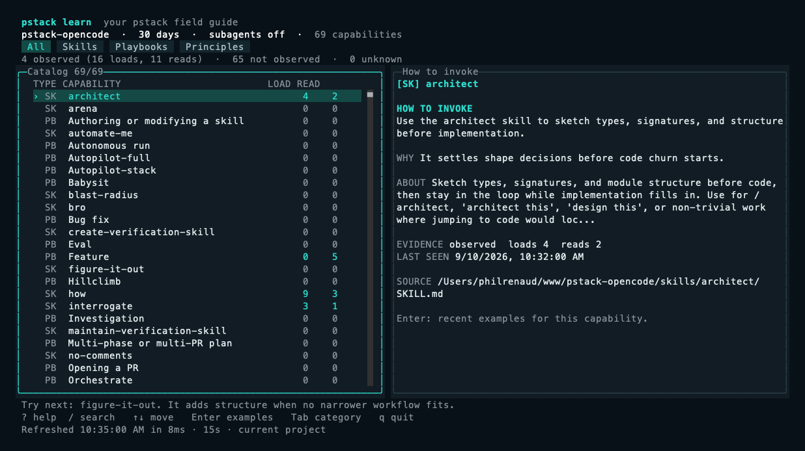

# Learn pstack from your terminal



Captured from the OpenTUI renderer with demo history. To regenerate on macOS, run `bun tools/learn/capture.ts .audit/learn-capture.json`, then `swift scripts/render-learn-capture.swift .audit/learn-capture.json docs/images/learn-opentui.png`.

Run this from the pstack-opencode clone:

```sh
bun install --frozen-lockfile --cwd tools/learn
./learn
```

The dashboard lists skills, principles, and poteto-mode playbooks from the files currently installed in this clone. Each entry includes a short explanation and a prompt you can copy into OpenCode. Adding a new skill or playbook makes it appear on the next refresh.

## Find something useful

1. Press `/` and search by name or task, such as `review`, `performance`, or `autopilot`.
2. Use arrows or `j` and `k` to select an entry.
3. Read its invocation in the detail pane. On a narrow terminal, press Right to open details and Escape to go back.
4. Press `c` to request clipboard copy, or `p` to print the invocation and exit. Neither action runs the prompt.

Press `u` to see only capabilities not observed in the selected history. Press `n` to jump to a suggested capability. Suggestions use a fixed beginner-friendly order followed by an alphabetical fallback. They are ideas to try, not assessments of your proficiency.

Press **Enter** to open up to five recent examples for the selected capability, newest first. Select an example with arrows or `j`/`k`, then press **Enter again** to see its exact conversation context. The excerpt includes the nearest original user request, nearby assistant messages, and the actual tool event in chronological order. Escape returns to examples, then to the catalog.

Examples respect the current project, time-window, and child-session filters. Only opening exact context reads message text, on demand, for the selected event's session. Synthetic tool echoes, file dumps, hidden reasoning, and tool outputs are excluded. Excerpts show at most two assistant messages before and after the event and stop before the next original user turn. Long text is capped with explicit truncation notices. Session IDs and resume commands remain available for the full conversation. Missing event IDs or unsupported history show an unavailable explanation rather than a guessed match.

## Understand the evidence

The dashboard reads local OpenCode tool metadata through a read-only SQLite connection. Exact context additionally reads original message text when you open it. It makes no model calls and uploads nothing. Background refresh, snapshots, and JSON reports do not fetch message bodies.

- **Loads** count successful `skill` tool calls for this catalog.
- **Reads** count successful reads of an exact skill or playbook file.
- **Not observed** means no matching evidence in the selected scope and time window.
- **Unknown** means the database, schema, scope, or relevant evidence could not be read reliably.

A file read may be research or review. A skill load does not prove that the agent followed the skill, and a playbook read does not prove that the workflow completed. References in conversation text, failed tool calls, and reads of a separate upstream checkout do not count.

The initial view covers the current project, the last 30 days, and top-level sessions. Child sessions are excluded by default. Separate CLI review sessions can be top-level, so this is not a perfect filter for audit activity. If old tool records lack the resolved skill directory, matching falls back to the skill name and displays a warning.

Use these keys to change the evidence scope:

| Key | Action |
| --- | --- |
| `s` | Toggle this project and all local projects |
| `w` | Cycle 7 days, 30 days, and all time |
| `a` | Include or exclude child sessions |
| `r` | Refresh immediately |
| Tab | Cycle skills, playbooks, principles, and all entries |
| `?` | Show controls and evidence definitions |
| Enter | Open recent examples for the selected capability |
| Enter on an example | Open the original conversation around that event |
| Right / Left | Focus details or the list |
| Ctrl-D / Ctrl-U | Scroll the focused pane |
| `q` / Ctrl-C | Quit and restore the terminal |

History and catalog refresh every 15 seconds. The footer shows when the last refresh finished and its query duration. Unchanged databases reuse cached narrow metadata rather than scanning transcript contents again.

## Use another project or a noninteractive report

```sh
./learn --project ~/www/my-project
./learn --all-projects
./learn --all-projects --include-subagents --window all
./learn --json
COLUMNS=100 LINES=28 ./learn --snapshot
```

The default project is the working directory where you launch the tool. To run it from another repository, use the absolute path to this clone's `learn` script. `--project` overrides the working directory for scope resolution.

`--db PATH` selects an explicit OpenCode database. `--catalog ROOT` selects another pstack catalog, mainly for verification. Missing data leaves the catalog usable with unknown usage. `--help` lists every flag.

The interactive tool uses OpenTUI's native layout, styled panes, and scroll containers. It requires Bun 1.3 or later and the locked dependencies. Headless reports do not initialize the terminal renderer. Development checks:

Down and Page Down keep the selected catalog row visible. Home and End jump to the first and last entries. Selection stays within the catalog pane; the explanation remains independently scrollable.

```sh
bun install --frozen-lockfile --cwd tools/learn
bun run --cwd tools/learn test
bun run --cwd tools/learn typecheck
python3 scripts/verify-learn.py
```

The last command drives a real pseudo-terminal with a temporary database. Evidence is saved to `.audit/learn-terminal.txt`. It does not alter your OpenCode history.
